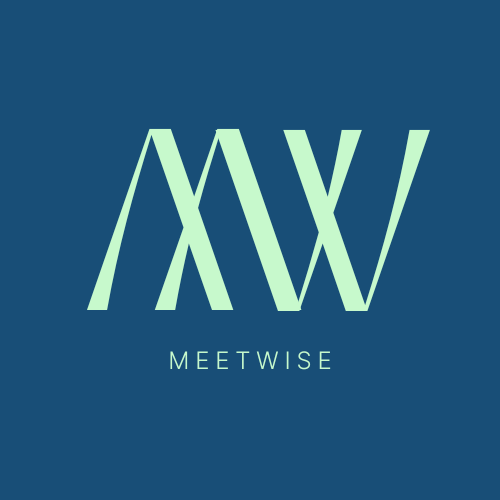

# MeetWise 💻

MeetWise is a robust meeting room booking system designed to streamline the process of reserving rooms in an organization. With an intuitive user interface, secure authentication, and comprehensive admin capabilities, MeetWise makes managing meeting spaces simple and efficient.


[](https://meeting-room-booking-system-client.vercel.app/)
[](https://meeting-room-booking-system-phi.vercel.app/)
[](https://github.com/safia-nusrat-official/meeting-room-booking-system)


## Table of Contents 📝

- [**Features**](#features)
- [**Getting Started**](#getting-started)
  - [Prerequisites](#prerequisites)
  - [Installation](#installation)
  - [Configuration](#configuration)
- [**Usage**](#usage)
- [**API Documentation**](#api-documentation)
- [**Technologies Used**](#technologies-used)
- [**Contact**](#contact)
  
## Features

- Authentication: Secure login and registration for all users.
- Profile Update: Users can update profile details thro
- Easy Room Browsing: Effortlessly navigate through a wide range of rooms with smooth filtering and sorting options.
- Smooth Room Booking: Add, remove, and manage items in your cart with ease, ensuring a seamless shopping experience.
- Detailed Room Pages: View comprehensive details, high-quality images, and specifications for each rooms.
- Fast Search: Quickly find products using our optimized search functionality.
- Secure Transactions: Complete bookings with secure payment methods (Stripe and PayPal).
- Custom Room Features: Add custom descriptions, ratings, and multiple images for each room.
- Booking Management: View, cancel, or modify existing bookings.
- Comprehensive Dashboard: Administrative control panel to manage, create, update, and delete products.
- Transactional Emails: Receive confirmation emails with transaction details when a booking is confirmed.
- Booking Approval: Confirm or cancel room bookings.
- Room Management: Add, update, or delete meeting rooms with ease.
- Slot Management: Add, update, or delete slots with ease.
- User Management: Manage user roles, including admin privileges.
- Reports & Analytics: Access detailed analytics for bookings and user activity.
- Multi-Image Uploading: Admins can upload multiple images for each room through ImgBB.
- User Profile Image Upload: Users can upload and manage their profile pictures via Cloudinary.
- Responsive Design: Fully functional on both mobile and desktop devices for a consistent experience across platforms.


## Getting Started 🚀
### Prerequisites 📋
Before you begin, please ensure you have the following dependencies installed:
```bash
Node.js (v20.11.0 or later)
npm (v20.11.0 or later)
ImgBB API Key for multi-image uploads
Cloudinary API Key and API Secret for user profile image
Stripe Secret Key for Secure Stripe Payment
PayPal Client Id and Secret for Successful PayPal Transactions
```
### Installation 🛠️
1. **Clone the repository:**
 ```bash
 git clone https://github.com/safia-nusrat-official/mechanical-keyboard-ecommerce-client.git
 cd meeting-room-booking-system-client
 ```

2. **Install the depecdencies:**
```bash
 npm install
 ```

3. **Set Environment Variables:**
Create a `.env` file in the root directory and add the following:
```env
VITE_IMGBBAPIKEY=<your_imgBB_apiKey>
VITE_STRIPE_PK=<your_stripe_pk>
VITE_PAYPAL_CLIENT_ID=<your_paypal_client_id>
```

4. **Run the Application**
```bash
npm run start
# or
yarn start
```

The application should now be running on http://localhost:5173 or http://localhost:5174


## Usage 📖:
### User Guide
- **Sign Up / Login:** Create an account or log in to browse through available rooms.
- **Search Rooms:** Filter and search for rooms by date, time, and capacity.
- **Book a Room:** Select an available room and complete the booking process.
- **Manage Bookings:** View, confirm, or cancel your bookings from the user dashboard.
- **Proceed to Payment:** Confirm your booking in the checkout page via stripe or paypal transaction.

### Admin Guide
- **Dashboard Access:** Log in as an admin to access the admin dashboard.
- **Manage Rooms:** Add, edit, or delete meeting rooms and their details.
- **Manage Slots:** create, reschedule, or delete slots.
- **Approve/Reject Bookings:** Review and manage all bookings.
- **User Management:** Manage user roles and access rights.


## API Documentation 🌐
The API Documentation can be found in the [Server Side Repository](https://github.com/safia-nusrat-official/meeting-room-booking-system)


## Technologies Used 💻
- Web-framework: **[Express.Js](https://expressjs.com/)**
- Programming Language: **[Typescript](https://www.typescriptlang.org/)**
- Formatters: **[ESLint](https://eslint.org/)**, **[Prettier](https://prettier.io/)**
- Authentication: **[JWT (JSON WEB TOKEN)](https://jwt.io/)**
- Payment Gateway: **[Stripe](https://stripe.com/), [PayPal](https://www.paypal.com/bd/home)**
- Library used: **[React](https://react.dev/)**
- State Mangament via: **[Redux](https://redux.js.org/)**
- Build Tool: **[Vite](https://vitejs.dev/)**
- CSS Framework:**[Tailwind CSS](https://tailwindcss.com/)**
- Component Library: **[ShadCN](https://ui.shadcn.com/)**
- React UI library:**[Ant-Design](https://ant.design/)**
- Image Storage: **[ImgBB](https://imgbb.com/)** for room images, **[Cloudinary](https://cloudinary.com/)** for user profile images
- Email Service: **[NodeMailer](https://nodemailer.com/)**
- Others:**[AOS](https://michalsnik.github.io/), [sonner](https://sonner.emilkowal.ski/), [moment](https://momentjs.com/)**
  
## Contact 📞
For any enquires or issues related installation, please reach out to us at _safia.nusrat.official@gmail.com_. We welcome yor feedback and are here to guide you through your troubles and clean up any confusions. Thank you 😊!

_[Safia Nusrat](https://github.com/safia-nusrat-official)_
